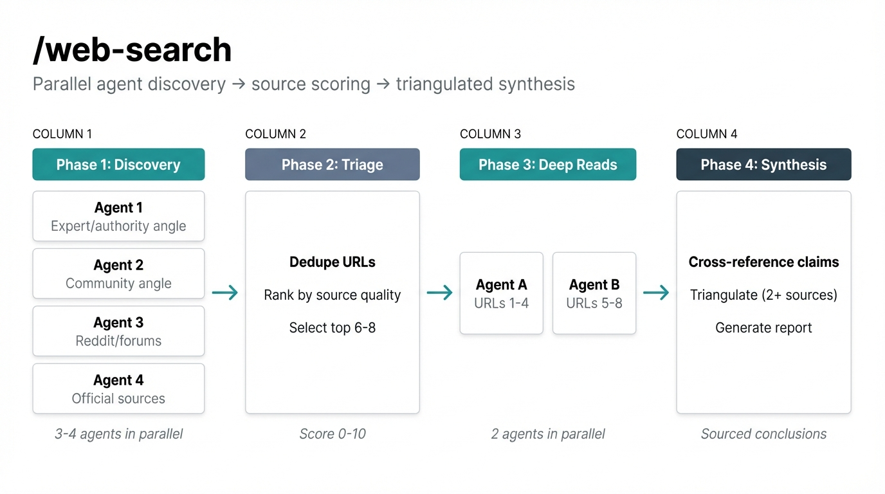
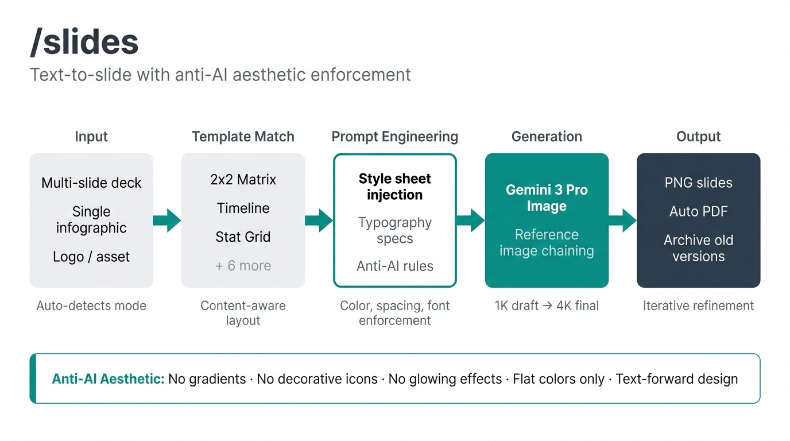
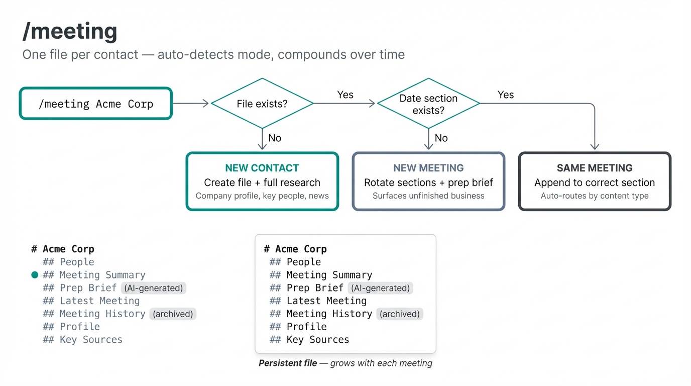

# Agentic Skills

Open-source skill definitions for AI-assisted workflows. Each skill is a `.md` file that acts as a system prompt for Claude Code's `/command` feature, paired with Python scripts where needed. Designed to be tool-agnostic — the patterns work with any agentic coding tool (Claude Code, Codex, Cursor, etc.).

These are redacted versions of production skills — company names, personal paths, and brand-specific details have been replaced with placeholders. The patterns, prompt engineering, and architecture are the real thing.

---

## A Note on Tools

**You don't need any of the included scripts to get started.** Claude Code has built-in `WebSearch` and `WebFetch` tools that handle most research and scraping out of the box — zero API keys, zero setup.

The Python scripts (Exa, Firecrawl, Reddit API) are optional power-ups that add coverage, speed, and specialized access. Use them if you want, swap in your own preferred tools (Tavily, Brave Search, SearXNG, Jina Reader, etc.), or skip them entirely.

The skill `.md` files — the prompt engineering, parallel agent patterns, source scoring, anti-AI aesthetics — work regardless of which search/scraping tools you plug in.

---

## Available Skills

### /web-search

Evidence-first research analyst with adaptive depth. Parallel agent discovery, source scoring (0-10), triangulation, and community search. Bring your own search tools or use the included Exa/Firecrawl/Reddit scripts.

**Scripts:** `exa_search.py`, `reddit_search.py`, `firecrawl_search.py`, `firecrawl_fetch.py`



### /slides

AI slide generation via Gemini native image gen. Includes anti-AI aesthetic rules, consulting templates, typography enforcement, and iterative refinement loops. Supports reference images for variations/edits.

**Scripts:** `gemini_slides.py`



### /meeting

Persistent per-contact meeting files that compound over time. Auto-detection (new contact vs follow-up), prep briefs, LinkedIn research, append routing, dashboard aggregation, and infographic generation.

**Scripts:** None — pure prompt engineering.



### /recommendations

Evidence-first product and venue recommendations. 4-agent parallel discovery, multi-AI synthesis (Claude + GPT + Gemini), confidence scoring, Reddit deep dives, and structured comparison tables with dual ranking (best buy vs finest quality).

**Scripts:** `multi_ai_recs.py`

### /writing

Bilingual (EN/JA) writing assistant with multi-AI drafting. Three models draft independently, Claude synthesizes the best version. Persistent draft file with auto-folding, version history, and style learning from past drafts.

**Scripts:** `multi_ai_writer.py`

### /discover

AI opportunity intelligence for enterprise prospects. PE-quality use case discovery with parallel research agents, EBITDA impact sizing, competitive heatmaps, and auto-generated PDF reports. Accepts company + team/person for hyper-specific use cases.

**Scripts:** Requires additional scripts (not yet included in this repo).

### /review

Multi-agent code and content review (5-agent pipeline × 2 cycles). Modes: code changes, visual/UI, design assets, skill/file review. Agents run in parallel with multi-AI synthesis for independent perspective.

**Scripts:** None — pure prompt engineering + optional multi-AI via OpenRouter.

### /plan

Structured planning for code, business, projects, or decisions. Auto-detects domain, calibrates research depth, produces evidence-backed plans with risk registers, dependency mapping, and execution monitoring.

**Scripts:** None — pure prompt engineering + optional multi-AI.

---

## How to Use

### 1. Install as Claude Code commands

Copy any `.md` file into your project's `.claude/commands/` directory:

```bash
cp agentic-skills/slides/slides.md your-project/.claude/commands/slides.md
```

Then invoke with `/slides` in Claude Code.

### 2. Customize for your brand

Each skill has `{PLACEHOLDER}` markers where you should add your own:
- Company name and logo paths
- Brand colors and typography
- Output directory conventions
- API keys (in your `.env`, never in the skill file)

### 3. Run the scripts (optional)

Scripts are standalone Python files. Copy them alongside the skill `.md` file. Only needed if you want the external API integrations:

```bash
pip install requests img2pdf
export GEMINI_API_KEY=your-key-here

python3 agentic-skills/slides/gemini_slides.py --test
```

**Without any scripts**, the skills still work — Claude Code uses its built-in tools as fallbacks.

---

## Architecture

```
.claude/commands/skill.md    ← Claude reads this as system prompt
scripts/script.py            ← Claude calls this via Bash tool (optional)
.env                         ← API keys (git-ignored)
```

The `.md` file tells Claude *what to do* and *how to think*. The Python script handles the API calls that Claude can't make directly (image generation, multi-model synthesis, etc.).

---

## Requirements

- **Claude Code** (claude.ai/code) — the CLI tool

**Optional (for enhanced capabilities):**
- **Gemini API key** — for `/slides` image generation
- **OpenRouter API key** — for `/writing`, `/recommendations`, `/review` multi-AI synthesis
- **Exa API key** — for `/web-search` semantic search
- **Reddit API credentials** — for `/web-search` and `/recommendations` community search
- **Firecrawl API key** — for `/web-search` page scraping
- **Python 3.10+** with `requests` and `img2pdf`

Or just use Claude Code's built-in `WebSearch` and `WebFetch` — no extra keys needed.

---

## License

MIT. Use however you want. Attribution appreciated but not required.
